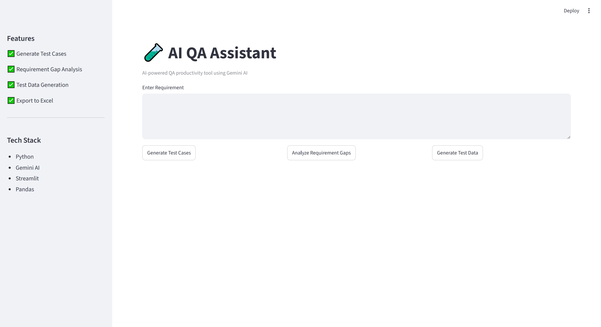
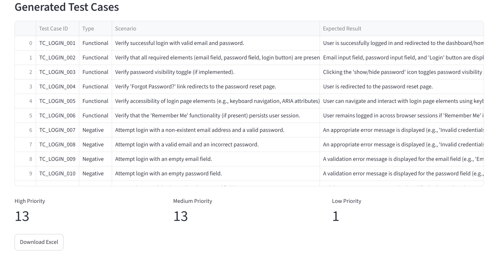
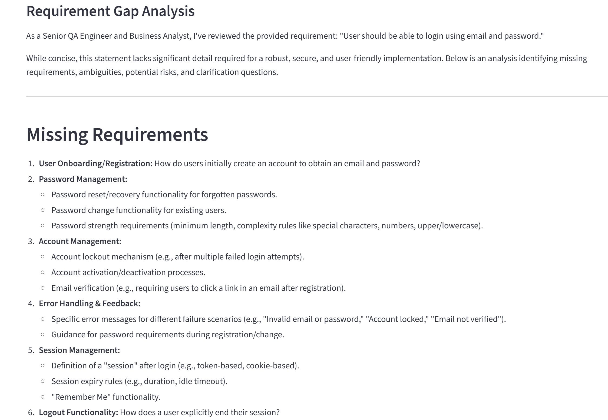
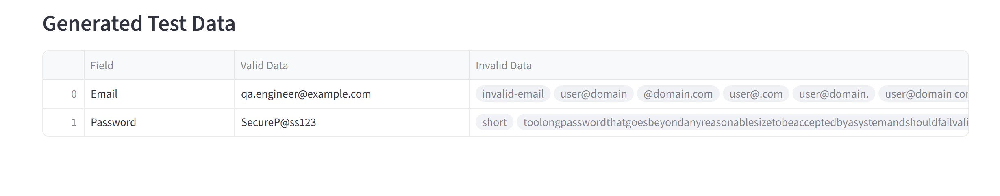

# 🧪 AI QA Assistant

An AI-powered QA productivity tool that generates software test cases from requirements using **Gemini AI** and **Streamlit**. The application helps QA engineers improve testing efficiency by generating structured test cases, analyzing requirement gaps, creating test data, and exporting results to Excel.

---

## 🚀 Features

### ✅ Test Case Generation
Generates:

- Functional Test Cases
- Negative Test Cases
- Boundary Test Cases
- Edge Test Cases

### ✅ Requirement Gap Analysis

Identifies:

- Missing Requirements
- Ambiguous Statements
- Potential Risks
- Clarification Questions

### ✅ Test Data Generation

Generates:

- Valid Test Data
- Invalid Test Data

### ✅ Excel Export

- Download generated test cases in Excel format
- Timestamp-based file naming

### ✅ Interactive Dashboard

- Streamlit-based UI
- Priority metrics visualization
- Responsive table display

---

## 🛠 Tech Stack

- Python
- Gemini AI
- Streamlit
- Pandas
- OpenPyXL

---

## 📂 Project Structure

```text
AI-QA-Assistant
│
├── app/
│   ├── gemini_service.py
│   ├── prompts.py
│   └── export_service.py
│
├── streamlit_app.py
├── main.py
├── requirements.txt
├── .gitignore
└── README.md
```

---

## ⚙️ Installation

Clone the repository:

```bash
git clone https://github.com/Akshat1644/AI-QA-Assistant.git
```

Move to the project folder:

```bash
cd AI-QA-Assistant
```

Install dependencies:

```bash
pip install -r requirements.txt
```

Run the application:

```bash
streamlit run streamlit_app.py
```

---

## 📸 Screenshots

### Home Page



### Test Case Generation



### Requirement Gap Analysis



### Test Data Generation



---

## 🔄 Workflow

```text
User Requirement
        ↓
Streamlit UI
        ↓
Prompt Templates
        ↓
Gemini AI
        ↓
JSON Parsing
        ↓
Pandas DataFrame
        ↓
Excel Export
```

---

## 🔮 Future Enhancements

- PDF Export
- Playwright Script Generation
- API Test Case Generation
- Severity Prediction
- Jira Integration
- Multi-user Support

---

## 💡 Example Use Cases

- Requirement Analysis
- Test Case Design
- Test Data Preparation
- QA Productivity Improvement
- Rapid Test Documentation

---

