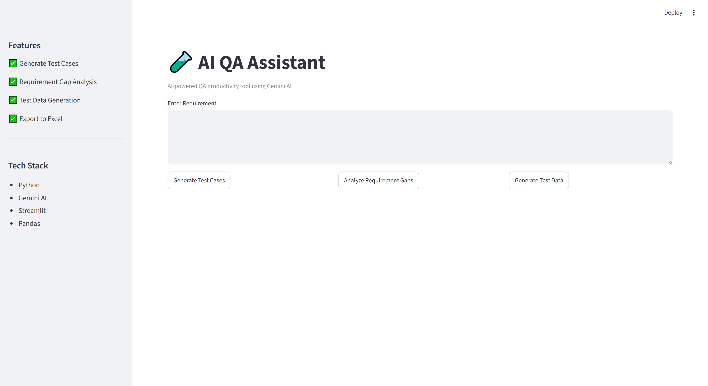
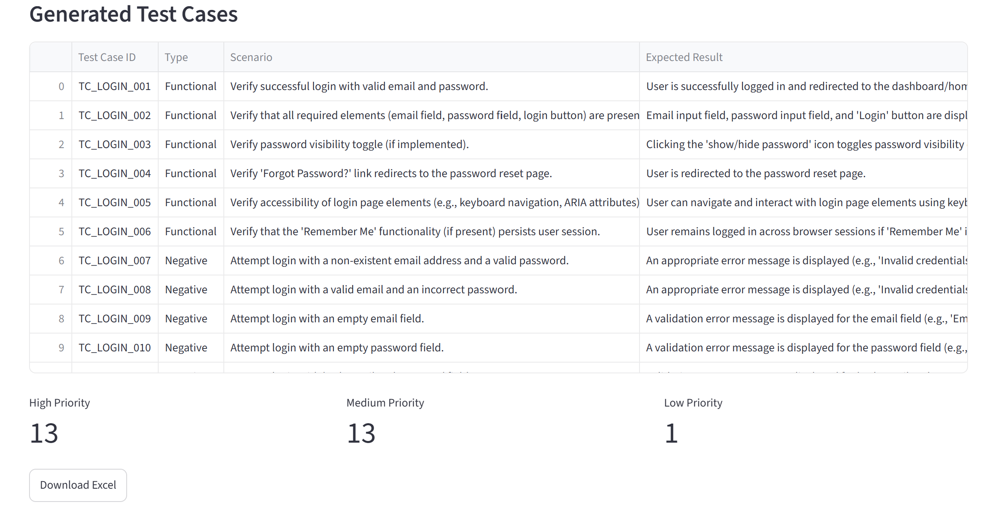
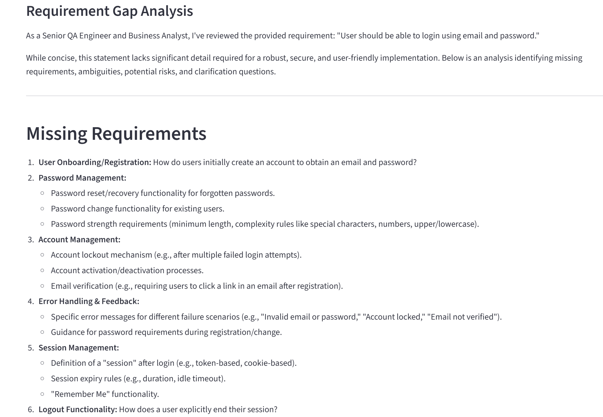
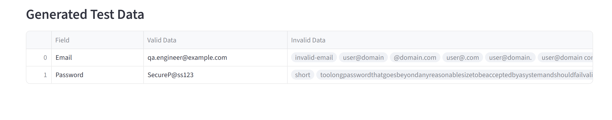

# 🧪 AI QA Assistant

An AI-powered QA productivity tool that helps software testers automate and accelerate the test design process using Google Gemini AI and Streamlit.

The application analyzes software requirements and automatically generates comprehensive test cases, identifies requirement gaps, creates realistic test data, and produces API test scenarios. It also supports exporting results to Excel and text formats, making it easier for QA teams to integrate AI into their daily testing workflow.

Key Features
✅ AI-generated functional and negative test cases
✅ Requirement Gap Analysis to identify missing or ambiguous requirements
✅ AI-generated test data for different validation scenarios
✅ API test case generation from API requirements
✅ Export generated test cases to Excel
✅ Download generated outputs as text files
✅ Interactive and user-friendly Streamlit interface
✅ Powered by Google Gemini AI for intelligent test generation
✅ Risk Analysis
✅ Defect Prediction

This project demonstrates how Generative AI can significantly reduce manual effort in software testing while improving test coverage, consistency, and overall QA productivity.
---

## 🚀 Features

### ✅ Test Case Generation
Generates:

- Functional Test Cases
- Negative Test Cases
- Boundary Test Cases
- Edge Test Cases

### ✅ Requirement Gap Analysis

Identifies:

- Missing Requirements
- Ambiguous Statements
- Potential Risks
- Clarification Questions

### ✅ Test Data Generation

Generates:

- Valid Test Data
- Invalid Test Data

### ✅ Excel Export

- Download generated test cases in Excel format
- Timestamp-based file naming

### ✅ Interactive Dashboard

- Streamlit-based UI
- Priority metrics visualization
- Responsive table display

---

## 🛠 Tech Stack

- Python
- Gemini AI
- Streamlit
- Pandas
- OpenPyXL

---

## 📂 Project Structure

```text
AI-QA-Assistant
│
├── app/
│   ├── gemini_service.py
│   ├── prompts.py
│   └── export_service.py
│
├── streamlit_app.py
├── main.py
├── requirements.txt
├── .gitignore
└── README.md
```

---

## ⚙️ Installation

Clone the repository:

```bash
git clone https://github.com/Akshat1644/AI-QA-Assistant.git
```

Move to the project folder:

```bash
cd AI-QA-Assistant
```

Install dependencies:

```bash
pip install -r requirements.txt
```

Run the application:

```bash
streamlit run streamlit_app.py
```

---

## 📸 Screenshots

### Home Page



### Test Case Generation



### Requirement Gap Analysis



### Test Data Generation



---

## 🔄 Workflow

```text
User Requirement
        ↓
Streamlit UI
        ↓
Prompt Templates
        ↓
Gemini AI
        ↓
JSON Parsing
        ↓
Pandas DataFrame
        ↓
Excel Export
```

---

## 🔮 Future Enhancements

- PDF Export
- Playwright Script Generation
- API Test Case Generation
- Severity Prediction
- Jira Integration
- Multi-user Support

---

## 💡 Example Use Cases

- Requirement Analysis
- Test Case Design
- Test Data Preparation
- QA Productivity Improvement
- Rapid Test Documentation

---

